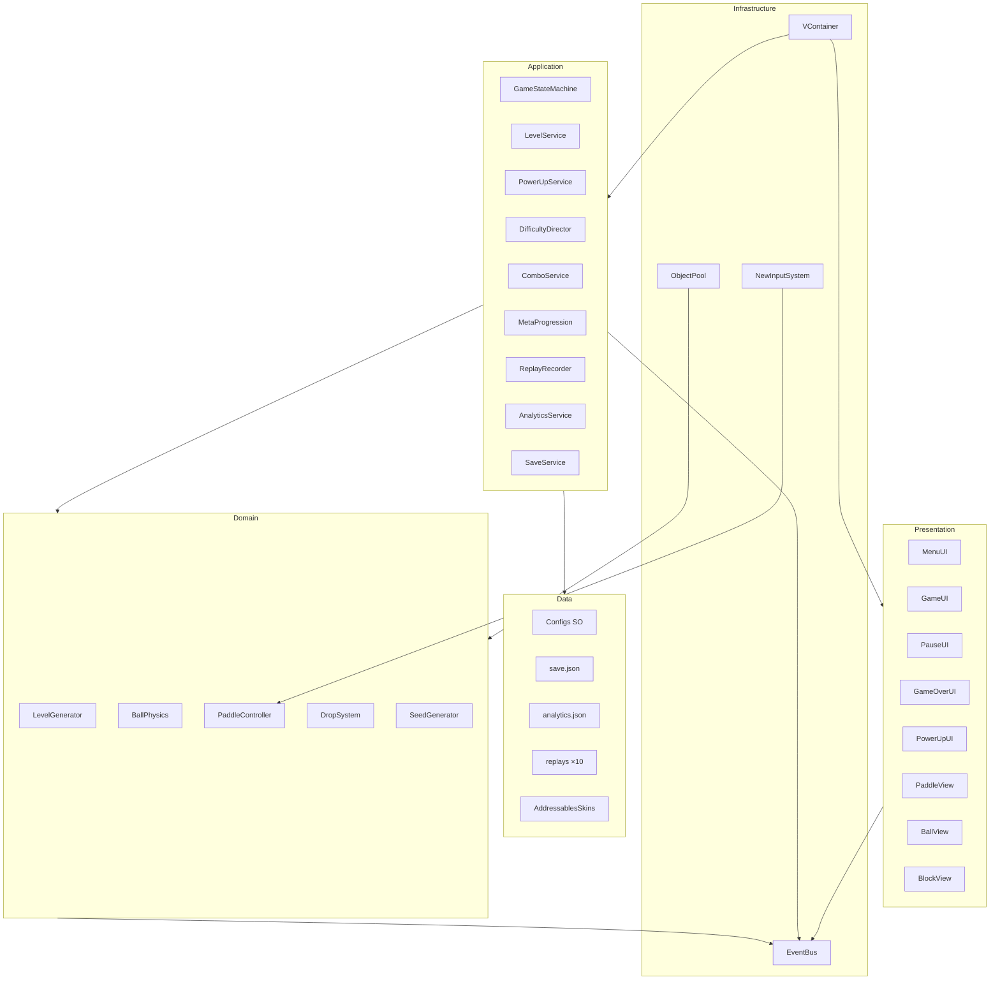
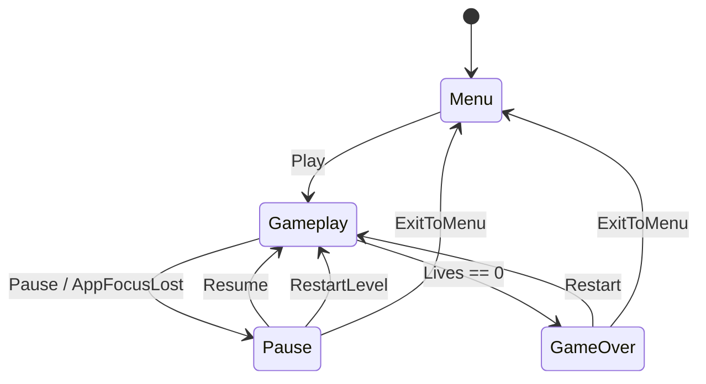
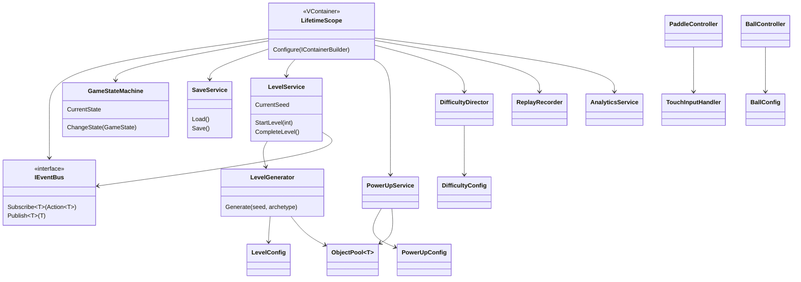

# Этап 0 — Архитектура: 3D Roguelike Arkanoid (MVP)

**Статус:** утверждён (@si)  
**Стек:** Unity **6000.5.5f1** · URP · VContainer · Addressables · New Input System · Object Pool · Event Bus · JSON  
**Цели платформ:** Android API 26+ · iOS 14+ · Target FPS 60  

---

## 1. Scope MVP

### Входит
- Touch-управление (две зоны/режима) + запуск мяча (Tap / Swipe Up)
- Платформа + мяч (непримитивная физика отскока)
- 3 жизни, бонус +1 Life (макс 5)
- Save JSON, Pause (+ авто-пауза)
- Seed-генерация, 3 архетипа (Tunnel, Fortress, Diamond), 5 типов блоков
- 8 бонусов, Drop System, UI таймеров
- Difficulty Director, Replay, Analytics (локально)
- ScriptableObject-конфиги, комбо, монеты, магазин скинов, meta-апгрейды
- Neon-визуал (Toon + Rim, Bloom, VFX); **сейчас MVP:** [псевдо-3D + приглушённое звёздное небо](visual-style-pseudo3d-starfield.md)

### Отложено
| Система | Версия |
|---------|--------|
| Туториал, враги | 1.1 |
| Боссы | 1.2 |
| Миры, монетизация | 1.3 |
| Достижения / ежедневки | 1.4 |

---

## 2. Слои (Clean Architecture)

```
Presentation  → MonoBehaviours / UI (Menu, HUD, Pause, GameOver, Views)
Application   → Services (Level, PowerUp, Difficulty, Combo, Meta, Replay, Analytics, Save)
Domain        → Generators, Physics rules, Drop rules, Seed
Data          → ScriptableObjects, save.json, analytics.json, replays
Infrastructure→ VContainer, EventBus, ObjectPool, Input System, Addressables
```

**Правило:** View ↔ View запрещены. Связь только через EventBus или инжект сервисов.

---

## 3. Диаграмма систем



---

## 4. State Machine



Состояния: `Menu` · `Gameplay` · `Pause` · `GameOver`.

---

## 5. UML — ядро классов



---

## 6. Матрица зависимостей

| Система | Зависит от | Не тянет напрямую |
|---------|------------|-------------------|
| Input | New Input System, PaddleConfig | Ball, Blocks |
| Paddle / Ball | Config SO, EventBus, Physics | UI, Save |
| LevelGenerator | Seed, LevelConfig, Pool | PowerUps |
| PowerUpService | PowerUpConfig, Pool, EventBus | Difficulty |
| DifficultyDirector | DifficultyConfig, метрики уровня | UI |
| SaveService | SaveData DTO, JSON | Gameplay Views |
| Replay | EventBus / input snapshot | Analytics |
| Analytics | Event DTO → JSON | Firebase (позже) |
| UI | EventBus + StateMachine | Domain factories |

---

## 7. Seed-контракт

```
Seed = (levelNumber * 1337 + 42) % 1_000_000
```

- Один детерминированный RNG на генерацию уровня.
- Debug override seed (скрытое меню / консоль).
- Replay привязан к seed + ленте действий.

---

## 8. Структура `Assets/_Project`

```
Assets/
└─ _Project/
   ├─ Scenes/          Menu.unity, Gameplay.unity
   ├─ Scripts/
   │  ├─ Core/         DI, EventBus, StateMachine
   │  ├─ Gameplay/     Paddle, Ball, Block, LevelGenerator
   │  ├─ PowerUps/
   │  ├─ Difficulty/
   │  ├─ Replay/
   │  ├─ Analytics/
   │  ├─ UI/
   │  ├─ Input/
   │  ├─ Save/
   │  ├─ Configs/      ScriptableObject types
   │  ├─ Effects/
   │  ├─ Pool/
   │  └─ Utils/
   ├─ Addressables/Skins/
   ├─ Prefabs/
   ├─ Configs/         .asset instances
   ├─ Materials/
   ├─ Shaders/
   ├─ VFX/
   ├─ Audio/
   └─ Settings/
```

**Нейминг:** папки/файлы PascalCase · поля camelCase · константы UPPER_SNAKE_CASE.  
**Комментарии:** на русском у публичных методов и сложной логики.  
**Параметры:** только ScriptableObjects (без хардкода в системах).

---

## 9. ScriptableObject-конфиги (MVP)

| Asset | Назначение |
|-------|------------|
| BallConfig | скорость, ускорение, макс, импульс платформы |
| PaddleConfig | размер, скорость, зона ввода |
| LevelConfig | сетка, архетипы, веса блоков |
| PowerUpConfig | шансы, длительности, лимиты |
| DifficultyConfig | пороги адаптации |
| ComboConfig | множители и пороги |
| PlayerConfig | жизни, стартовые монеты |

**Решение Director:** скелеты SO создаются на **Этапе 1** вместе с Core (не ждать Этап 8).

---

## 10. План этапов разработки

| Этап | Содержание | Роль |
|------|------------|------|
| 0 | Архитектура (этот документ) | @si + Tech Lead |
| 1 | VContainer, EventBus, StateMachine, Save, скелеты SO | Unity Developer |
| 2 | Input + Paddle + Ball | Unity Developer |
| 3 | Seed levels + 3 архетипа + 5 блоков | Unity Developer |
| 4 | 8 PowerUps + Drop + UI таймеров | Unity + UI Dev |
| 5 | Difficulty Director | Unity Developer |
| 6 | Replay record / play / export | Unity Developer |
| 7 | Analytics local JSON | Unity + Analytics |
| 8 | Полная настройка всех SO defaults | Unity Developer |
| 9 | Coins, shop, meta | Unity + UI |
| 10 | Menu / HUD / Pause / GameOver / Combo UX | UI Developer |
| 11 | VFX, audio, haptics, Bloom | Art/TA + Sound |
| 12 | Pool polish, Addressables, profile, Android/iOS | Unity + Perf QA |

После каждого этапа — приёмка пользователя («Продолжить на Этап N?»).

---

## 11. Оптимизация (контракт)

**Запрещено:** Instantiate/Destroy в Update · Find/GetComponent в Update · LINQ в горячих циклах.  
**Обязательно:** Object Pool · Addressables для скинов · FixedUpdate для физики · Update для UI/ввода · `Application.targetFrameRate = 60`.

---

## 12. QA-каскад (после реализации)

Unit → Integration → Performance (60 FPS) → UI (4 разрешения / SafeArea) → QA → QA Lead → QA Director → doc-writer.

---

## 13. Приёмка Этапа 0

- [x] Слои и границы ответственности
- [x] State Machine
- [x] UML и матрица зависимостей
- [x] Seed-контракт
- [x] Структура `_Project`
- [x] Порядок этапов + роли
- [x] SO на Этапе 1 (решение Director)
- [x] Документ зафиксирован в репозитории

**Следующий шаг:** ✅ Этап 1 выполнен — см. [stage-1-core-systems.md](stage-1-core-systems.md).  
**Актуально:** Этап 2 — [stage-2-input-paddle-ball.md](stage-2-input-paddle-ball.md).
